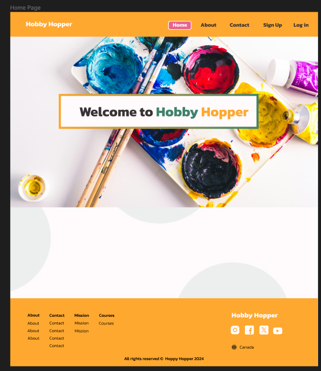
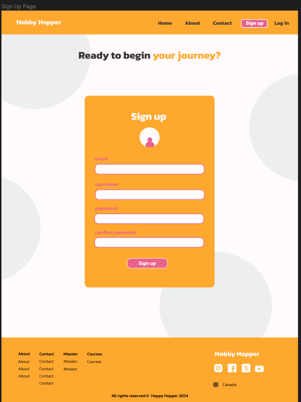
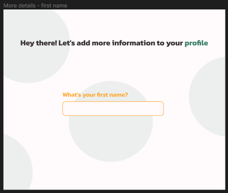
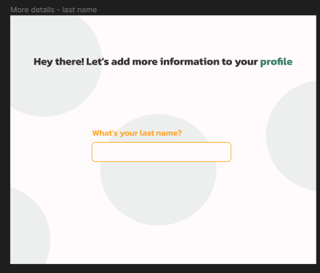
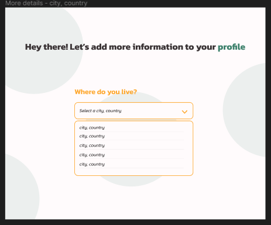
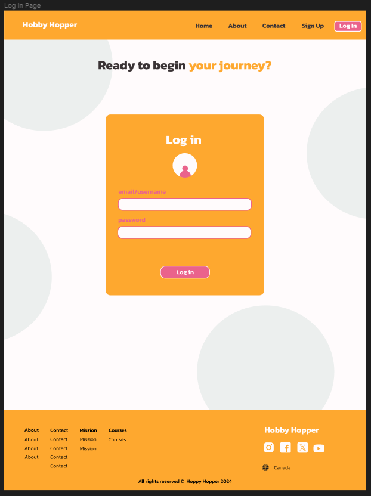
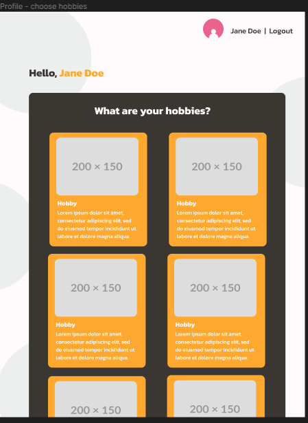
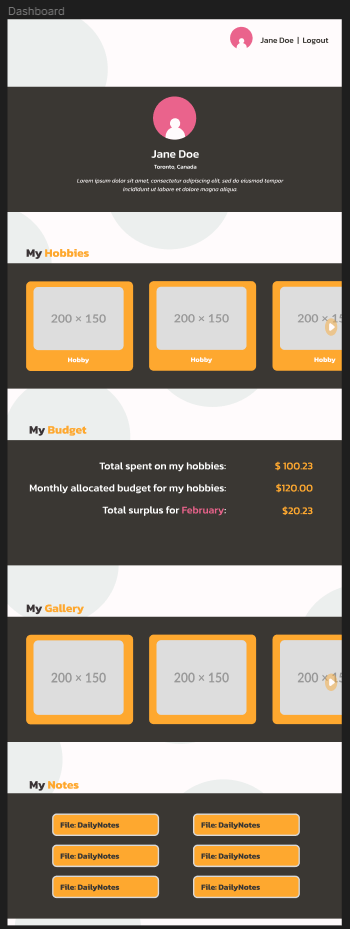
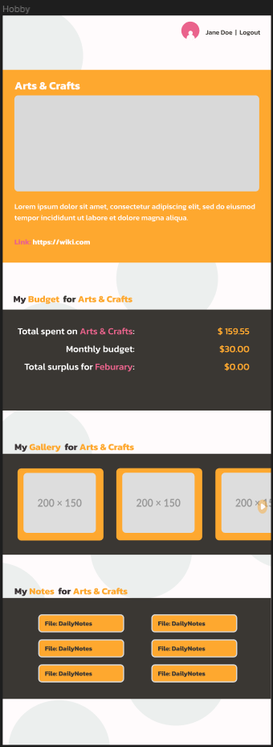

# Hobby Hopper

## Overview

Hobby Hopper is a platform where people with multiple hobbies --or struggle to keep any-- track their hobbies, budget.

### Problem

Starting and maintaining a hobby can be a pretty dawning task. It can get overwhelming when starting out and having so many resources available on the internet telling you to do one thing or the other. Moreover, tracking your current hobby's progress and resources can get confusing.

### User Profile

1. **Hobbyists**
   - people who have old hobbies that they want to start tracking
2. **Curious Hobbyists**
   - people who are just starting out with a new hobby or want to start a new hobby
3. **Curious Cats**
   - anybody who just wants to explore the site

### Features

- _Signing up, logging in, and profile customization_
  - User will be able to sign up and customize their profiles with a unique username, profile picture, and bio
- _Choose a hobby/hobbies_
  - Browse through a list of hobbies to pick and choose the hobbies user wants to track. It will be added to the user's profile.
- _Dashboard_
  - A list of all the hobbies the user has added will be displayed in their dashboard. Upon clicking on the hobby, they will be taken to a page with more details about that hobby.
- _Hobby details_
  - User will be able to view all details regarding this hobby including:
    - hobby name
    - date added
    - gallery
    - notes
    - budget tracker
- _Social media (if there's time)_
  - Users can create posts with descriptions
  - There will be a feed for each person
  - Other users can interact with the post (like, comment, share etc...)

## Implementation

### Tech Stack

- React
- TypeScript
- MySQL
- Express
- Client libraries:
  - react
  - react-router
  - axios
  - MUI
- Server libraries:
  - knex
  - express
  - JWT for tokens
  - bcrypt for password hashing

### APIs
1. Hobby API - created by me
2. http://geodb-cities-api.wirefreethought.com/
3. https://www.dicebear.com/

### Sitemap

- **Home**
  - Description
    - the first page of the website
    - information about the website is here
  - Routes
    - /
    - /home
<!-- - **Contact**
  - Description
    - a contact form page for inquiries
  - Routes
    - /contact
- **About**
  - Description
    - a page with details about how the webiste works
  - Routes
    - /about -->
- **SignUp**
  - Description
    - page where a user can sign up
  - Routes
    - /signup
- **LogIn**
  - Description
    - page where a user can log in to their account
  - Routes
    - /login
- **AddDetails**
  - Description
    - page where a user adds their information after signing up
  - Routes
    - /add-details
- **Profile**
  - Description
    - page where a user can choose their hobbies
  - Routes
    - /profile
- **Dashboard**
  - Description
    - page where a user can view their hobbies and information
  - Routes
    - /dashboard

### Mockups

#### Home page

#### Sign-up Page

#### Add Details Page (upon sign up)
##### Step 1

##### Step 2

##### Step 3

#### Log-in Page

#### Profile - Choose Hobbies (upon first login only)

#### Profile - Dashboard

#### Hobby

### Data

Describe your data and the relationships between them. You can show this visually using diagrams, or write it out.

### Endpoints

List endpoints that your server will implement, including HTTP methods, parameters, and example responses.

### Auth

Does your project include any login or user profile functionality? If so, describe how authentication/authorization will be implemented.

## Roadmap

Scope your project as a sprint. Break down the tasks that will need to be completed and map out timeframes for implementation. Think about what you can reasonably complete before the due date. The more detail you provide, the easier it will be to build.

## Nice-to-haves

Your project will be marked based on what you committed to in the above document. Under nice-to-haves, you can list any additional features you may complete if you have extra time, or after finishing.