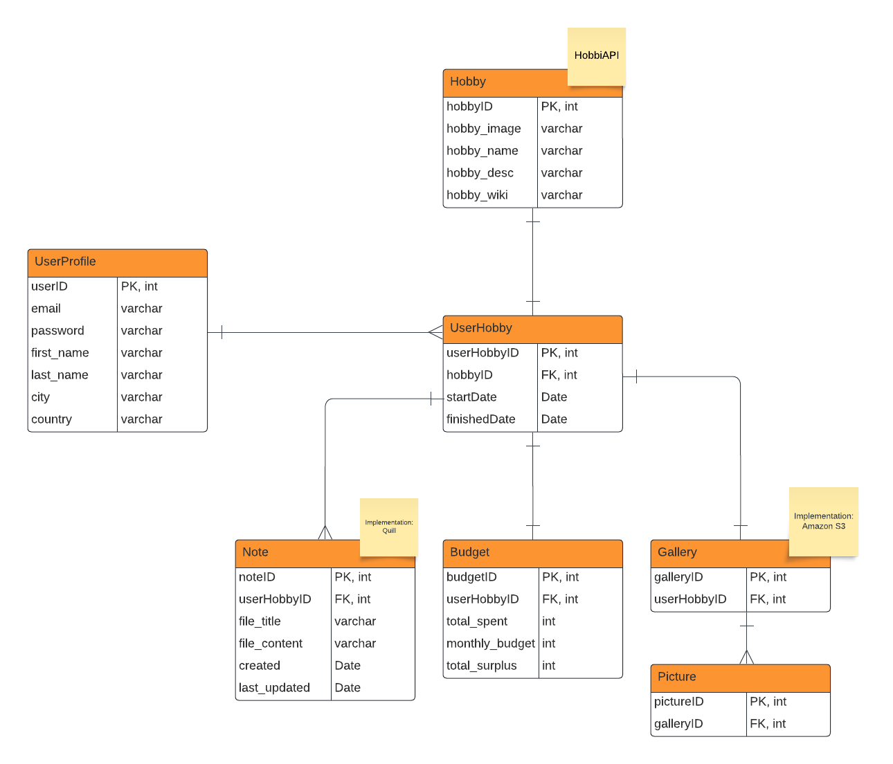

# Hobby Hopper

## Overview

Hobby Hopper is a platform where people with multiple hobbies --or struggle to keep any-- track their hobbies, budget.

### Problem

Starting and maintaining a hobby can be a pretty dawning task. It can get overwhelming when starting out and having so many resources available on the internet telling you to do one thing or the other. Moreover, tracking your current hobby's progress and resources can get confusing.

### User Profile

1. **Hobbyists**
   - people who have old hobbies that they want to start tracking
2. **Curious Hobbyists**
   - people who are just starting out with a new hobby or want to start a new hobby
3. **Curious Cats**
   - anybody who just wants to explore the site

### Features

- _Signing up, logging in, and profile customization_
  - User will be able to sign up and customize their profiles with a unique username, a random generated avatar through an API, and a bio
- _Choose a hobby/hobbies_
  - Browse through a list of hobbies to pick and choose the hobbies user wants to track. It will be added to the user's dashboard.
- _Dashboard_
  - A list of all the hobbies the user has added will be displayed in their dashboard. Upon clicking on the hobby, they will be taken to a page with more details about that hobby.
  - Users will be able to track their budget spent on each hobby
  - Users will be able to add images
  - Users will have access to note files
- _Hobby details_
  - User will be able to view all details specific to this hobby including:
    - hobby name
    - date added
    - gallery
    - notes
    - budget tracker

## Implementation

### Tech Stack

- React
- TypeScript
- MySQL
- Express
- Client libraries:
  - react
  - react-router
  - axios
  - MUI
- Server libraries:
  - knex
  - express
  - JWT for tokens
  - bcrypt for password hashing

### APIs

1. Hobby API - created by me
2. http://geodb-cities-api.wirefreethought.com/
3. https://www.dicebear.com/

### Sitemap

- **Home**
  - Description
    - the first page of the website
    - information about the website is here
  - Routes
    - /
    - /home
- **SignUp**
  - Description
    - page where a user can sign up
  - Routes
    - /signup
- **LogIn**
  - Description
    - page where a user can log in to their account
  - Routes
    - /login
- **AddDetails**
  - Description
    - page where a user adds their information after signing up
  - Routes
    - /add-details
- **AddHobbies**
  - Description
    - page where a user can choose their hobbies
  - Routes
    - /add-hobbies
- **Dashboard**
  - Description
    - page where a user can view their hobbies and other information
  - Routes
    - /dashboard

### Mockups

#### Home page


#### Sign-up Page


#### Add Details Page (upon sign up)

##### Step 1


##### Step 2


##### Step 3


#### Log-in Page


#### Profile - Choose Hobbies (upon first login only)


#### Profile - Dashboard


#### Hobby


### Data



### Endpoints

**GET /dashboard/:userID**

- assuming the user is logged in, will display the dashboard for the user with the corresponding data

Parameters:

- _userProfileID_: user's ID as it is in the database

Response:

```
{
    "userID": 1,
    "email": "janedoe@gmail.com",
    "password": "janedoe123", //will be bycrypted once endpoint is implemented
    "first_name": "Jane",
    "last_name": "Doe",
    "city": "Toronto",
    "country": "Canada",
    ...
}
```

**GET /hobby/:userProfileID**

Parameters:

- _userProfileID_: user's ID as it is in the database

Response:

```
{
    "hobbyID: 5,
    "userID": 1,
    "startDate": 10/11/2024
    "endDate": "",
    ...
}
```

### Auth

- Client
  - after sign up, send data to server
  - after log in, send data to server, set session JWTtoken
- Server
  - use JWTtoken to login and verify user

## Roadmap

1. **Initiation**
   - define project
   - understand what the project will do
   - create a proposal document
   - choose a tech stack
2. **Planning**
   - create mockups
   - plan database and tables
   - create user cases
3. **Execution**
   - Server - create HobbiAPI
     - create database
     - initialize express
     - create migration file
     - create seed file
     - test API
   - Server - create HobbyHopper
     - create database
     - initialize express
     - create migration files
     - create seed files (dummy values)
     - test database
   - Client - create mixins
   - Client - create pages (non-functional)
     - create home page
     - create sign up page
     - create add details page (stepper)
     - create login page
     - create profile page (use HobbiAPI to fetch data)
     - create dashboard page
     - create hobby page
   - Client - apply functionality
     - apply functionality to sign up page and connect to database
     - continue sign up process (add details page)
     - apply functionality to login page and connect to database
     - apply functionality to profile page (send data to profile)
     - apply functionality to dashboard page (pass states and fetch data)
     - apply functionality to hobby page (fetch data)
4. **Monitoring and Controlling**
   - Test sign up and login processes
   - Test dashboard page and ensure data is being fetched properly
   - Test hobby page and ensure data is fetched correctly
5. **Closing**
   - DEMO DAYYYYYYYYY

## Nice-to-haves

- ### Social media
  - Users can create posts with descriptions
  - There will be a feed for each person
  - Other users can interact with the post (like, comment, share etc...)
- ### Contact Page
  - a contact form page for inquiries
- ### About Page
  - a page with details about how the webiste works
- ### Courses / Walkthrough / Tutorials
  - a page where users can have access to tutorials for their hobbies
